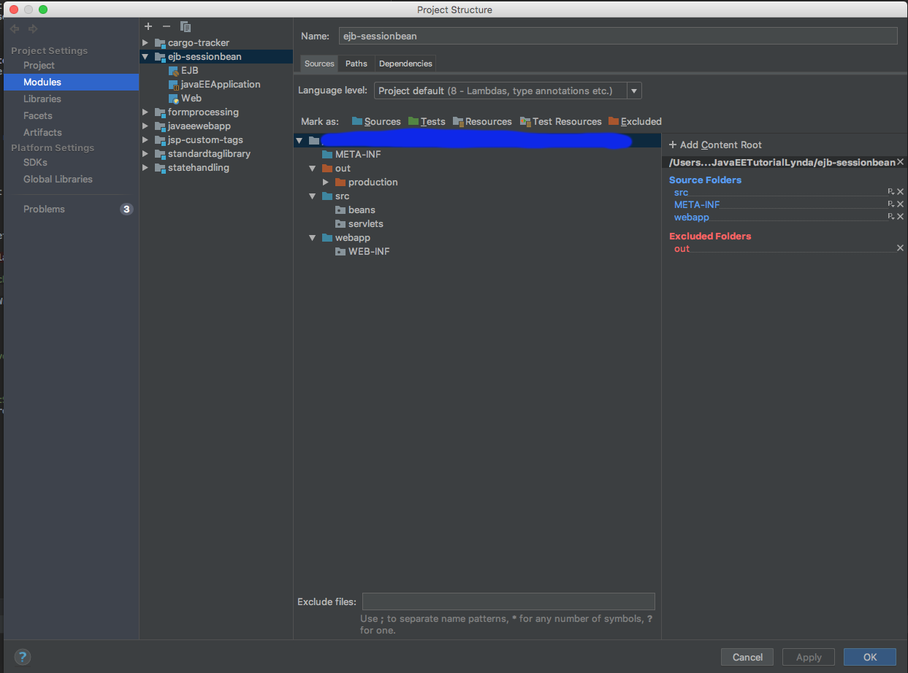

# Enterprise Java Examples

## General Environment Setup
* This is a multi module project, most of the modules can be imported as Java Web Application in intellij
* All applications run within tomcat container

### Environment Setup for EJB - TomEE
1. TomEE plus installed
1. Supported frameworks: EJB, JavaEE, Web
1. Artifacts for deployment: EAR, WAR
1. Under `ejb-sessionbean` Project Structure -> Web -> select root sources: `webapp, META-INF, src`
1. Set domain.xml configuration in glassfish to `<java-config classpath-suffix="" debug-options="-Xdebug -Xrunjdwp:transport=dt_socket,server=y,suspend=n,address=9009" java-home="/Library/Java/JavaVirtualMachines/jdk1.8.0_65.jdk/Contents/Home" debug-enabled="true" system-classpath="">`

